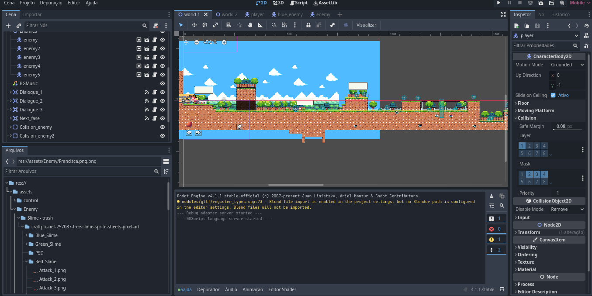
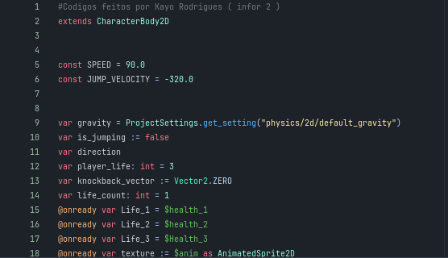
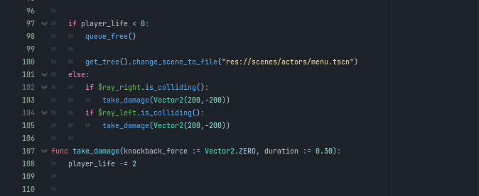
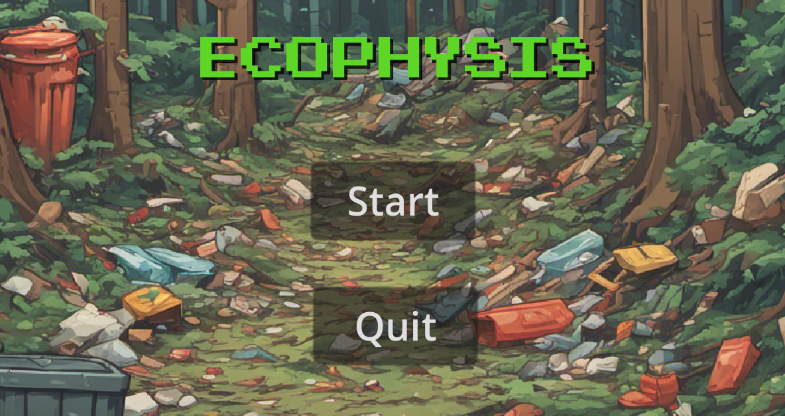
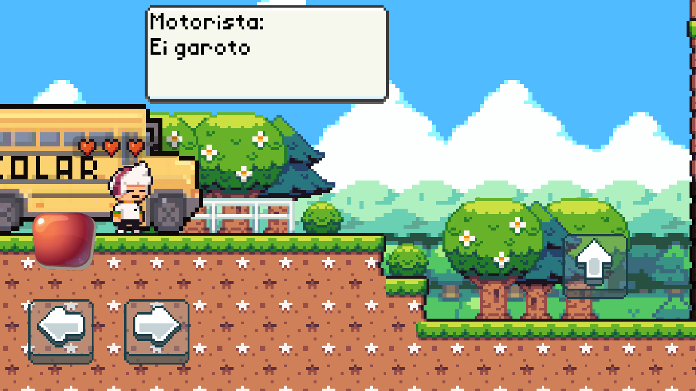
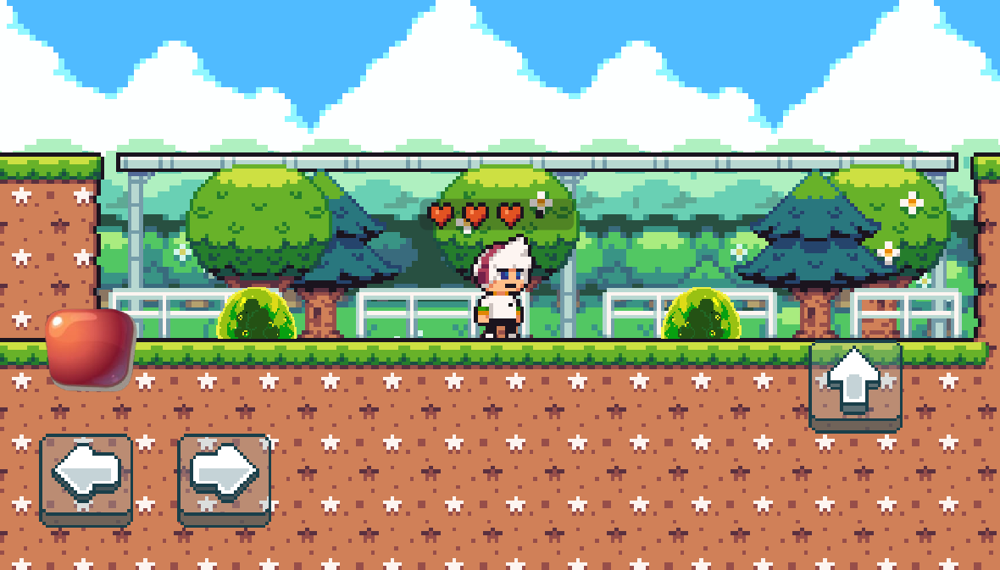
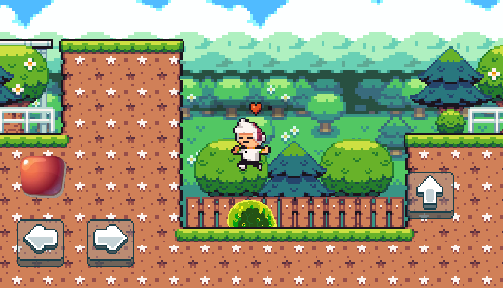
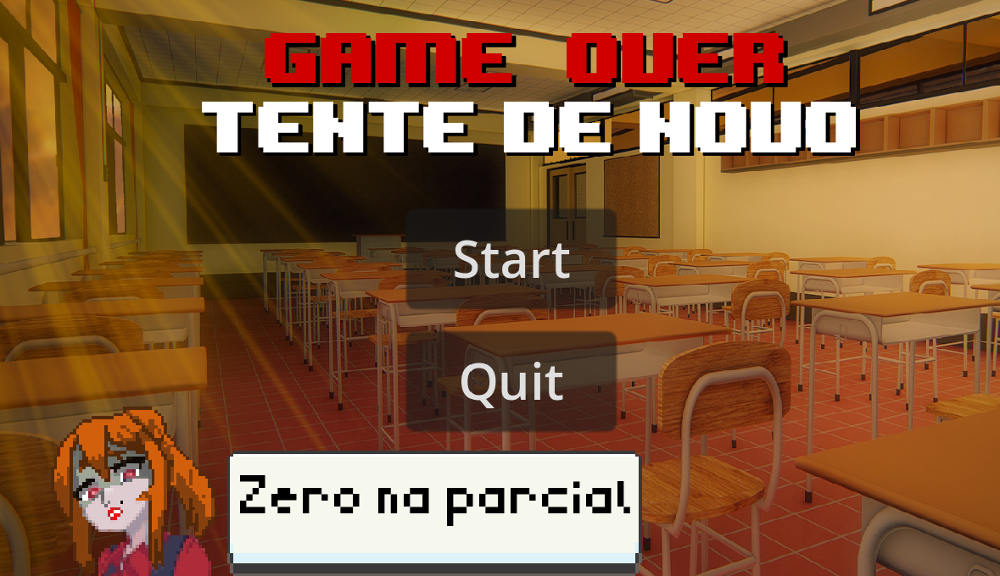

# Ecophysis
⬜ Projeto em andamento

## Desenvolvido por: 
<ul>
<li><a href="https://github.com/KayoRodrigues1235" target="_blank">Kayo Rodriguez</a>: Desenvolveu todo o roteiro, script, cenas, telas, sons, diálogos e a lógica do jogo. Fazendo com que o jogo obtesse o resultado desejado.</li>
<li><a href="https://github.com/JeovaneSilva" target="_blank">Jeovane Lima</a>: fundador do projeto e participou da criação da tela de menu, revisão dos scripts e pesquisas sobre ideias para agregar no jogo.</li>
</ul>

 

## Ferramentas Utilizadas:
<ul>
  <li></li>
  <li></li>
  <li></li>
</ul>

## O Que é o Projeto?

A ideia do projeto surgiu a partir de uma extensa pesquisa centrada em jogos associados ao meio ambiente, o presente 
estudo propôs a concepção de um jogo em formato 2D. Esse jogo tem como propósito a abordagem de diversas 
problemáticas ambientais, valendo-se da implementação de programação aliada a uma estratégia educacional baseada 
em gamificação. Por meio dessa abordagem, os estudantes podem engajar-se em desafios ao longo do jogo, os quais 
se debruçam sobre questões ambientais de relevância. 

 

## ✅​ Objetivos:
<ul>
<li> Promover Conscientização: Desenvolver a consciência ambiental dos jogadores, aumentando seu 
entendimento sobre questões ambientais e seus impactos.</li>
<li> Estimular Comportamentos Sustentáveis: Incentivar os jogadores a adotarem práticas sustentáveis no 
cotidiano, como reciclagem, economia de energia e redução do uso de plásticos.</li>
<li>Incentivar Reciclagem: Ensinar os jogadores a separar e reciclar corretamente os resíduos, reforçando a 
importância desse hábito.
</li>
<li>Incentivar Reciclagem: Ensinar os jogadores a separar e reciclar corretamente os resíduos, reforçando a 
importância desse hábito.
</li>
<li> Fomentar Mudanças de Atitude: Esperar que, ao final do jogo, os jogadores tenham uma maior 
predisposição para adotar práticas mais sustentáveis em suas vidas cotidianas.</li>
</ul>

 

## ​📷​ Imagens do Projeto:

 
<h2> Tela de desenvolvimento da Godot </h2>

<h2> Script do jogador</h2>
 

 

<h2>Tela de menu </h2>

<h2>Tela incial do jogo</h2>

<h2>Tela de exemplo dos monstros gosmentos</h2>

<h2>Tela de como matar os monstros</h2>

<h2>Tela dos itens coletáveis espalhados pelo mapa</h2>

<h2>Tela Game Over</h2>
 

 

## Considerações finais:

Gostariamos de expressar nossa mais profunda gratidão a todos que dedicaram seu tempo para ler sobre o nosso projeto. Cada olhar atento, cada minuto gasto compreendendo o que estamos tentando alcançar aqui é uma luz que ilumina nosso caminho. Seu apoio é um lembrete constante de que não estamos sozinhos nesta jornada e que nossa comunidade é repleta de pessoas generosas e apaixonadas. Estamos ansiosos para continuar compartilhando nosso progresso e colaborando com todos vocês. Juntos, podemos fazer grandes coisas e criar um impacto significativo. 

